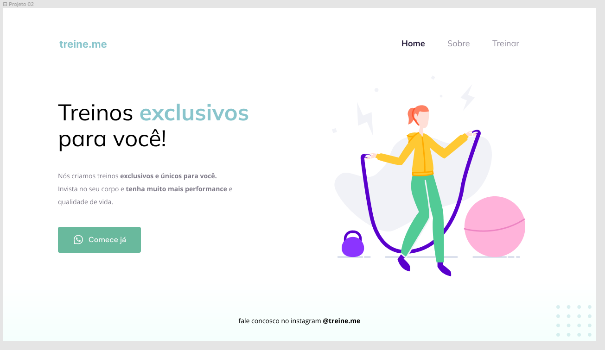

<h1 align="center"> Projeto 02 </h1>

  <a href="#-tecnologias">Tecnologias</a>&nbsp;&nbsp;&nbsp;|&nbsp;&nbsp;&nbsp;
  <a href="#-projeto">Projeto</a>&nbsp;&nbsp;&nbsp;|&nbsp;&nbsp;&nbsp;
  <a href="#-layout">Layout</a>&nbsp;&nbsp;&nbsp;

 

  

## 🚀 Tecnologias

Esse projeto foi desenvolvido com as seguintes tecnologias:

- HTML e CSS
- Figma

## 💻 Projeto

O Treine Me é um projeto voltado para divulgar metodologias de ensino.
- [Acesse o projeto finalizado, online](https://devbonatto.github.io/MoveisMoveis/)

## 🔖 Layout

Você pode visualizar o layout do projeto através [DESSE LINK](https://www.figma.com/file/Vg3ISQxLN0jEOW3ud4tsSY/Explorer-Projeto-02-Copy?fuid=1256335722836990720).
